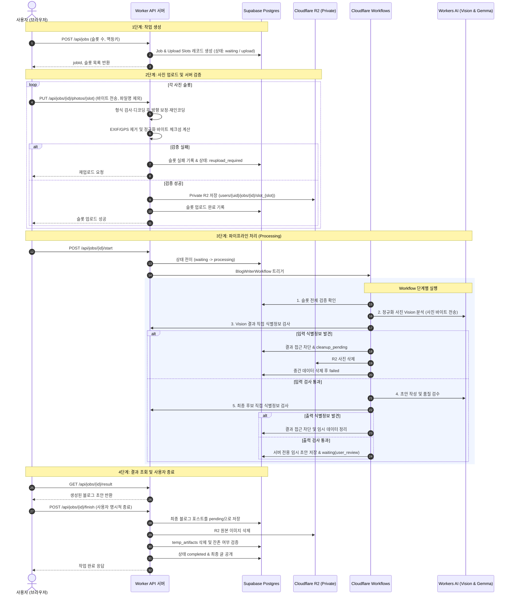
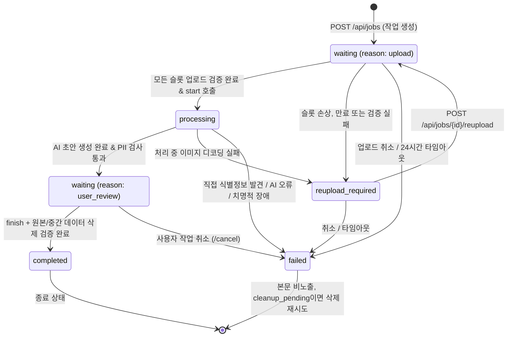
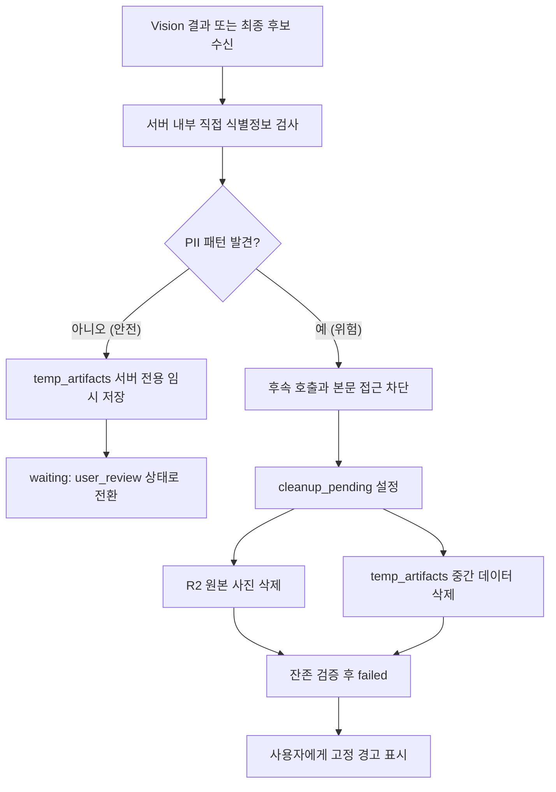
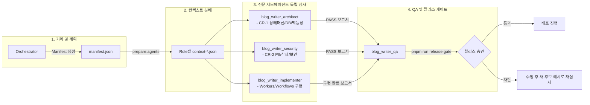

# blog_writer 프로젝트 프로세스 맵 (Process Map)

본 문서는 개인용 비공개 MVP의 **목표 프로세스**를 시각화합니다. 현재 소스는 스캐폴드 단계이며 이 흐름이 구현 완료되었음을 의미하지 않습니다.

---

## 1. 전체 비즈니스 수명주기 프로세스 (End-to-End Lifecycle)

사용자가 사진을 등록하고 블로그 글 초안을 생성한 뒤, 최종 확인과 임시 데이터 삭제 검증을 거쳐 완료되는 목표 흐름입니다.

---

## 2. 서버 전용 상태 머신 전이도 (State Transition Map)

시스템의 상태는 오직 서버에서만 전이되며, `waiting`, `processing`, `reupload_required`, `completed`, `failed` 5개로 엄격히 제한됩니다.

---

## 3. 보안 및 PII(개인정보) 실시간 방어 프로세스

---

## 4. 유지관리 하네스 및 서브에이전트 협업 흐름 (Harness Workflow)

> **[필수 개발 원칙]** 시스템의 모든 기능 구현, 아키텍처 변경, 보안 감사, QA 배포 심사는 **항상 하네스 구조의 전문 서브에이전트를 호출**하여 진행합니다. 오케스트레이터는 독립적인 각 역할(`System Architect`, `Security Auditor`, `Workflow Implementer`, `Technical QA`)을 `invoke_subagent`로 호출하여 병렬/순차 심사를 수행하고, 모든 서브에이전트의 승인(`APPROVED`)을 획득한 후 릴리스 게이트를 통과시킵니다.

---

## 5. 핵심 정책 요약 매트릭스

| 구분 | 주요 제약 및 정책 | 검증 하네스 |
|---|---|---|
| **상태 제어** | 클라이언트 직접 변경 금지, 5대 상태 엄격 유지 | `check:state`, `tests/state-machine.test.mjs` |
| **개인정보 보호** | 사진은 Workers AI에서 처리, 직접 식별정보 발견 시 후속 호출·본문 노출 차단 | 규칙 단위 테스트, 구현 후 통합 테스트 필요 |
| **데이터 보관** | 원본·중간 산출물 최대 24시간, 사용자 종료 시 조기 삭제 | `SECURITY-PRIVACY.md` 목표 기준 |
| **AI 모델 운영** | Vision: Llama 3.2 11B, Draft: Gemma 4 26B (일일 무료 범위 최적화) | Cloudflare Workers AI 바인딩 |
| **품질 및 배포** | 개인용은 `verify`, 공개 전에는 강화된 역할·해시 게이트 적용 | `verify`, 향후 강화할 `release:gate` |
